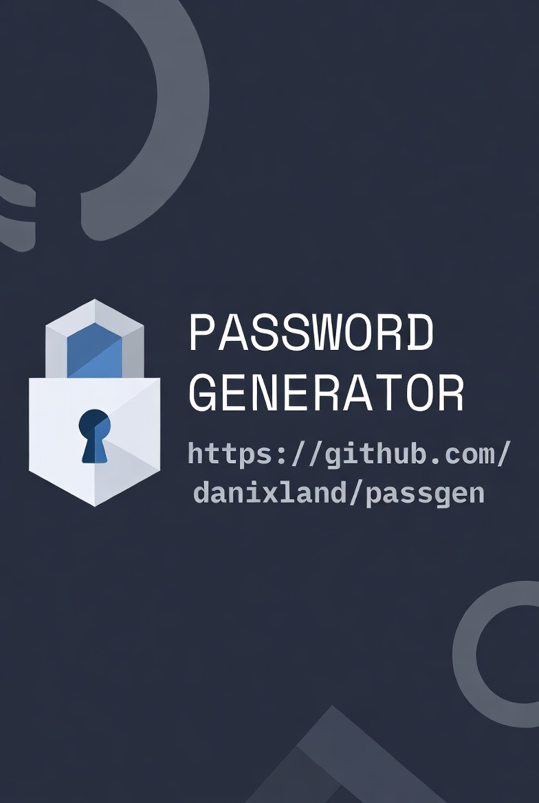

# passgen.py

This Python script generates strong, easy to memorize passwords using random words from a dictionary file.

## Installation

1. Ensure Python 3.x is installed on your system. 
2. You'll also need the [zxcvbn-python](https://github.com/dwolfhub/zxcvbn-python) module. 
   You can install it with `pip install zxcvbn` or using your distro package manager.
3. The default dictionary is `/usr/share/dict/words`, make sure you have it in your system or change it in the script.
4. Clone the repository to your local machine:

```bash
$> git clone https://github.com/danixland/passgen.git
```
3. Navigate to the project directory:
```bash
$> cd passgen
```

## Usage

The script can be run directly from the command line specifying the number of words to use and optionally, some other options:

```bash
$> python passgen.py <num_words> [options]
```

Optionally you can make it executable and move it in your `$PATH` with:

```bash
$> chmod +x passgen.py && mv passgen.py ~/bin
```

In this example I am using `~/bin`, change according to your system. Or not, I'm not your dad 😜

### Options

- `-c, --clipboard`: copies the password to the clipboard. (NOTE: it currently only works in wayland, no X11 implementation since I don't use it)
- `-s, --separator SEPARATOR`: Specify a custom separator symbol from our list (default: `@`). See [Separators](#separators).
- `-r, --random-separator`: Use a random separator from a predefined list.
- `-t, --strength`: Display the strength of the generated password. (this output is not suitable for piping into other applications)
- `-0, --no-numerals`: Disable numbers in the password.
- `-A, --no-capitals`: Disable capitalized words in the output.

### Examples

1. Generate a 3-word password (the default if no argument is passed) with default settings:
   ```bash
   $> python passgen.py
   cosmetics@tachometers@Acolyte3
   ```

2. Generate a 6-word password with a custom separator `!`:
   ```bash
   $> python passgen.py 6 -s !
   mediation!police!crossword!cannery!border!Reflexivity0
   ```

3. Generate a 7-word password using a random separator and no numbers:
   ```bash
   $> python passgen.py 7 --random-separator -0
   pastor=attractors=aluminum=alumna=wintered=apostrophes=Commonplaces
   ```

4. Generate an 8-word password with capitalized words disabled:
   ```bash
   $> python passgen.py 8 -A
   favorably@fairly@infect@nears@inverter@swiftest@breathers@lieutenant0
   ```

5. Generate a (weak) 1 word password with a short min lenght, with no capitals and no numbers, but test its strenght:

   ```bash
   $> python passgen.py 1 -A0 --min-length 6 --strength
   Generated Password: catsup
   Strenght: Bad (2/5)
   Suggestions: Add another word or two. Uncommon words are better.
    - Online Hashing Slow (100 attempts per hour): 6 days
    - Online Hashing Fast (10 attempts per second): 22 minutes
    - Offline Hashing, Slow: 1 second
    - Offline Hashing, Fast: less than a second
   ```
*Also, the output is colored* :grin:

6. Copy the generated password to your wayland clipboard

    ```bash
    $> python passgen.py -c
    Churchyard@hopes@focused8
    ```
    
    Now you can simply `Ctrl+v` your password into another application.

## My password is bigger than yours!

I know *comparison is the thief of joy*, but in this case, let's see how different a regular, random 12-character password looks and performs next to a beautiful 3-words passphrase:

| 12 Boring Random characters | 3 Memorable words              |
| --------------------------- | ------------------------------ |
| xb(cIZaVQmP9                | cosmetics@tachometers@Acolyte3 |

Apart from the obvious benefit of being much more memorable to the human that will have to use it, there's also the added benefit of being much stronger than that ugly bunch of nonsense. [Proton's password strenght calculator](https://proton.me/pass/password-strength-tester), gives centuries to crack the first password, against thousand of years to crack the latter.

This is because one of the key components of [password entropy](https://en.wikipedia.org/wiki/Password_strength), is its length, and longer passwords mean longer times to bruteforce it.

## Separators

The script uses this list of separators:

```python
["~", "!", "@", "#", "$", "%", "^", "&", "*", "(", ")", "_", "-", "+", "=", "{", "}", "[", "]", "|", ":", ";", "<", ">", ",", ".", "?"]
```

## Contributing

Contributions are welcome! Feel free to fork the repository and submit a pull request.

1. Fork the repository.
2. Create your feature branch: `git checkout -b feature/AmazingFeature`
3. Commit your changes: `git commit -m 'Add some AmazingFeature'`
4. Push to the branch: `git push origin feature/AmazingFeature`
5. Open a pull request.

## License

This project is licensed under the GPLv2 License - see the [LICENSE](LICENSE) file for details.

## Inspiration


thanks [xkcd](https://xkcd.com/936).

## Author

 - [danix](https://danix.xyz) - it's just me, really...

## Interesting reads on the argument

- [password evolved - authentication guidance for the modern era](https://www.troyhunt.com/passwords-evolved-authentication-guidance-for-the-modern-era/)
- https://haveibeenpwned.com/Passwords
- [owasp cheat sheet on authentication](https://cheatsheetseries.owasp.org/cheatsheets/Authentication_Cheat_Sheet.html)